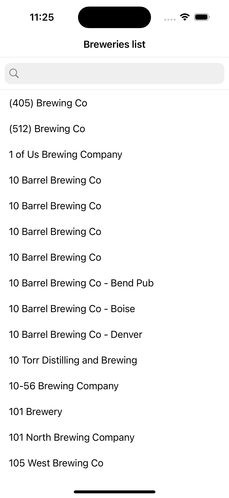
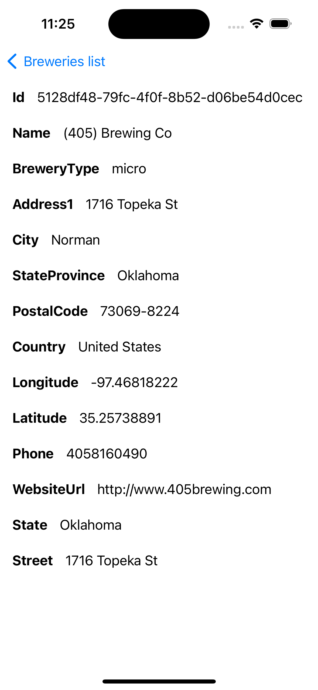

# .NET Android and .NET iOS Application for OpenBreweryDB

## 1. Overview

This mobile application is developed **for Android and iOS** platforms <u>using .NET</u>. The application consumes the **OpenBreweryDB API** to <u>list breweries</u> and display detailed information about each brewery. The API endpoint used is https://api.openbrewerydb.org/v1/breweries.

 

## 2. Requirements

### Software Requirements
- Visual Studio with .NET Android and .NET iOS installed (optionally you can use Rider or VS Code)
- .NET 8.0 SDK or higher
- Android SDK
- iOS SDK
- Android Emulator or physical Android device
- iOS Emulator or physical iOS device
- Internet connection

### Hardware Requirements
- macOS operating system

## 3. Installation

### Cloning the Repository

`git clone https://github.com/nunomir45/Brewery-MobileApp`

### Setting Up the Environment
- Open the project in Visual Studio / Rider / VS Code.
- Restore the required NuGet packages.
- Set up the emulators or physical devices for testing.

## 4. Features

- **Brewery Listing:** The application makes a GET request to https://api.openbrewerydb.org/v1/breweries and displays the list of breweries.
- **Brewery Details:** By selecting a brewery, the application displays detailed information about the selected brewery.

## 5. Project structure

Brewery-MobileApp/

- Brewery-MobileApp/
    - <u>Brewery.Core</u>/ # Shared code
        - Constants/ # Constants files
        - Helpers/ # Helpers classes
        - Resources/ # Dictionary or other resources files
        - ViewModels/ # Business logic
        - Services/ # Services (Including API calls)
    - <u>Brewery.Droid</u>/ # Project Android
        - Resources/ # Images and layouts
        - Helpers/ # Helper classes
        - Services/ # Crossplatform services or other utilities
        - UI/ # UI logic goes here
            - Activities/
            - Adapters/
            - Fragments/
            - ViewHolders/ # ViewHolders from Adapters
    - <u>Brewery.iOS</u>/ # Project iOS
        - Helpers/ # Helper classes
        - Services/ # Crossplatform services or other utilities
        -  UI/ # UI logic goes here
            - Cells/ # Cells from UITableViews
            - ViewController/ #ViewControllers
- DocumentationAssets
-  README.md # Documentation
-  .gitignore

## 6. Definition of Done

| **Criteria**                    | **Description**                                                                                                   | **Status** |
|---------------------------------|-------------------------------------------------------------------------------------------------------------------|------------|
| **Functional Requirements**     |                                                                                                                   |            |
| Splash Screen                   | Splash screen which loads data from the Brewery API successfully.                                                        |      Done      |
| Breweries listing                    | Data retrieved from the Brewery API is displayed correctly on the list screen.                                             |  Done          |
| Breweries listing - Search bar                   | In the Breweries listing screen it's possible to search from the name of the brewery.                                             |  Done          |
| Breweries listing - Empty state                   | In the Breweries listing screen, in case there is no item to display, it should present an empty state.                                           |  Incomplete          |
| Detail View                     | Clicking on a brewery in the list displays the correct detail view.                                                  |      Done      |
| Detail View - URL                    | Clicking on an URL opens the browser to view it's content.                                                 |     Done       |
| **Testing**                     |                                                                                                                   |            |
| Unit Tests                      | It was written Unit tests for ViewModels and services and it did pass successfully.       |     Done       |
| Integration Tests               | It was created a project in Postman and tested the Brewery API to ensure everything was working as expected.               |      Done      |
| Manual Testing                  | Manual testing has been performed on multiple devices to ensure the application behaves as expected.              |     Done       |
| UI Tests                        | It was created user interface tests to verify the correct navigation from splash screen to list and detail views.                    |   Incomplete         |
| **Code Quality**                |                                                                                                                   |            |
| Single responsibility                     | Classes and methods have a single responsibility and are not overloaded with multiple functionalities.                                                                 |     Done       |
| Refactoring                      | Refactoring is performed regularly to improve code readability and maintainability.                 |      Done      |
| Clean Code                      | The code follows established coding standards.                | Done
| Dictionary                      | There is a dictionary that stores all the text displayed to the user within the app.             |  Done
| Documentation              | There is documentation for the application that explains it's main features and how to run it.                                                   |      Done      |
| **Security**                    |                                                                                                                   |            |
| Data security                   | Data security practices, including encryption of sensitive data, have been implemented.                           |     N/A       |
| Certificate Pinning             | Certificate pinning is correctly implemented to secure API communications.                                         |     Done       |
| Jailbraik/root validation                   | Jailbraik and root validation was implemented to prevent sensitive data issues and reducing risks of malicious app manipulation.                                               |     Incomplete       |
| **Deployment**                  |                                                                                                                   |            |
| Automated Build                 | Automated build for both Android and iOS is configured and functioning correctly.                                 |      Incomplete      |
| CI/CD Pipeline                  | Continuous integration and continuous delivery pipeline is set up and tested for both Android and iOS.            |      Incomplete      |
| Firebase / Appcenter  | The application is configured in Firebase or App Center to monitor bugs in post-production.       |      Incomplete      |

## 7. References

- [.NET Android and .NET iOS](https://dotnet.microsoft.com/en-us/apps/mobile) 
- [OpenBreweryDB API Documentation](https://openbrewerydb.org)
